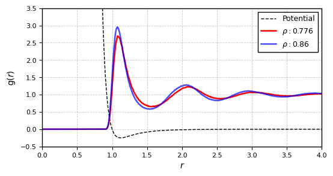
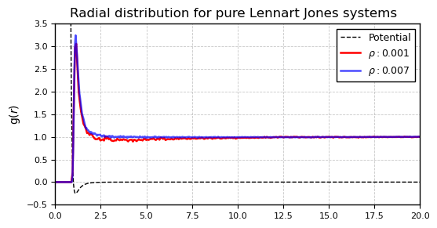
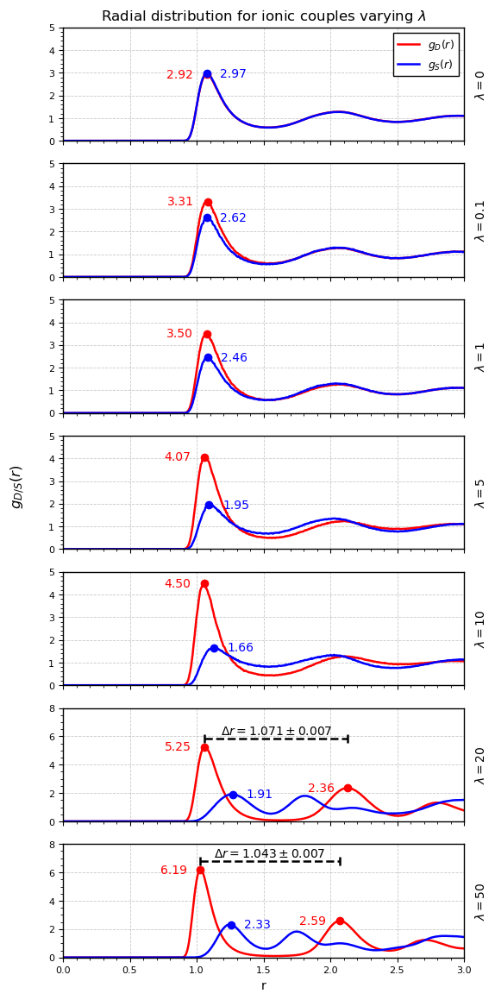

# Monte Carlo particle simulation under long and short range interaction

Build the project using the given ./build.sh to ensure the creation of all the needed folder.

## Results from simulation of a pure Lenaard-Jones system ($\lambda = 0$)

Results from simulation of a pure LJ system, compared with the NIST reference data.  
In the table can be found in order: temperature, density, mean energy per particle and mean energy per particle (NIST) in reduced units, followed by acceptance rate and step correlation.  
Energy errors are estimated as the standard deviation of the energy divided by the square root of the effective number of uncorrelated samples \( $N_{step} / 2\tau$ \) and it is interpreted as a 68% confidence level.

| T    | ρ     | U/N (sim)                | U/N (NIST)               | Pₐ  | τ   |
|------|-------|--------------------------|--------------------------|-----|-----|
| 0.85 | 0.001 | -0.009799 ± 1.1e-5       | -0.01032 ± 2e-5          | 99% | 0.5 |
| 0.85 | 0.007 | -0.07214 ± 3e-5          | -0.07283 ± 1.3e-4        | 99% | 0.5 |
| 0.85 | 0.776 | -5.511 ± 2e-3            | -5.5121 ± 4e-4           | 50% | 206 |
| 0.85 | 0.86  | -6.023 ± 3e-3            | -6.0305 ± 2.3e-3         | 42% | 289 |

### Equilibrium radial density functions $g(r)$

## Results from simulation of a Lennard-Jones + Coulomb system ($\lambda \not= 0$)

Results from simulation of a Lennard-Jones + Coulomb system as the coupling constant λ varies.

Energy errors are estimated as the standard deviation of the energy divided by the square root of the effective number of uncorrelated samples and it is intereted as 68% confidence level.

| T    | ρ    | λ   | U/N              | P_A | τ   |
|------|------|-----|------------------|-----|-----|
| 0.85 | 0.86 | 0   | -6.030 ± 0.006   | 40% | 291 |
| 0.85 | 0.86 | 0.1 | -6.015 ± 0.007   | 43% | 74  |
| 0.85 | 0.86 | 1   | -6.546 ± 0.007   | 43% | 72  |
| 0.85 | 0.86 | 5   | -9.195 ± 0.011   | 42% | 158 |
| 0.85 | 0.86 | 10  | -12.738 ± 0.010  | 41% | 124 |
| 0.85 | 0.86 | 20  | -17.505 ± 0.005  | 66% | 123 |
| 0.85 | 0.86 | 50  | -35.393 ± 0.009  | 48% | 316 |

Ionic coupling radial distribution  as $\lambda$ varies. $g_D$ and $g_S$ are plotted (For a formal definition, refer to subsection~\ref{subsec:rad_distribution}). For $\lambda$ equal 20 and 50 a strong second peak in $g_D$ appears, the distance between the two maxima is plotted as $\Delta r$. The uncertainty on $\Delta r$ comes from an assumed uniform distribution over the bins containing the two maximum.
