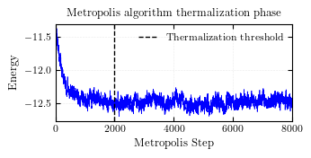
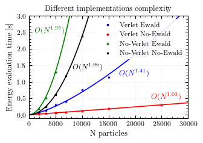
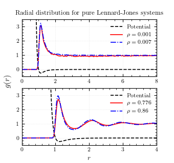

# Metropolis Monte Carlo Simulation of Lennard-Jones and Coulomb Systems


Monte Carlo simulation of interacting particles under **periodic boundary conditions** using the **Metropolis algorithm** in the canonical ensemble (NVT).

The code supports systems interacting through:

- **Lennard–Jones potential** (short-range interactions)
- **Coulomb potential** computed with **Ewald summation**

To improve computational efficiency, short-range interactions are evaluated using **Verlet neighbor lists**, reducing the complexity from O(N²) to approximately O(N) per Monte Carlo step.

The implementation is written in **C** and designed for studying the equilibrium properties of dense particle systems such as **Lennard-Jones fluids, ionic liquids, and strongly coupled plasmas**.

---

## Table of Contents

- [Features](#features)
- [Physical Model](#physical-model)
- [Units](#units)
- [Compilation](#compilation)
- [Running a Simulation](#running-a-simulation)
- [Main Simulation Parameters](#main-simulation-parameters)
  - [Interaction parameters](#interaction-parameters)
  - [System configuration](#system-configuration)
  - [Thermodynamic parameters](#thermodynamic-parameters)
  - [Monte Carlo parameters](#monte-carlo-parameters)
  - [Simulation length](#simulation-length)
  - [Neighbor list parameters](#neighbor-list-parameters)
  - [Ewald summation](#ewald-summation)
- [Output](#output)
  - [Energy time series](#energy-time-series)
  - [Radial distribution functions](#radial-distribution-functions)
- [Typical Simulation Workflow](#typical-simulation-workflow)
- [Code Structure](#code-structure)
- [Validation](#validation)
  - [Performance Scaling](#performance-scaling)
  - [Lennard-Jones simulation against NIST reference data](#lennard-jones-simulation-against-nist-reference-data)
- [Possible Extensions](#possible-extensions)

---

## Features

- Metropolis Monte Carlo sampling (NVT ensemble)
- Lennard-Jones potential with cutoff
- Tail correction for truncated Lennard-Jones interactions
- Coulomb interaction via **Ewald summation**
- Periodic boundary conditions
- **Verlet neighbor lists** for efficient short-range interactions
- Radial distribution function $g(r)$
- Charge-resolved radial distributions $g_{++}(r)$, $g_{--}(r)$, $g_{+-}(r)$
- Lattice initialization (CC, BCC, FCC)
- Binary checkpoint system for restarting simulations
- CSV output for easy post-processing

[⬆ Back to top](#table-of-contents)

---

## Physical Model

Particles interact through the potential

$U(r) = U_{LJ}(r) + \lambda U_{Coulomb}(r)$

### Lennard-Jones potential

$U_{LJ}(r) = 4\epsilon [ (\sigma/r)^{12} − (\sigma/r)^6 ]$

### Coulomb potential

$U_{Coulomb}(r) = \frac{q_i q_j}{r}$

The Coulomb interaction is computed using **Ewald summation**, which decomposes the interaction into:

- real-space short-range contribution
- reciprocal-space contribution
- self-interaction correction

[⬆ Back to top](#table-of-contents)

---

## Units

Simulations are performed in **Lennard-Jones reduced units**:

| Quantity | Value |
|--------|--------|
| $\sigma$ | 1 |
| $\epsilon$ | 1 |
| $k_B$ | 1 |

Therefore:

- temperature is dimensionless
- distances are measured in units of $\sigma$
- energies are measured in units of $\epsilon$

[⬆ Back to top](#table-of-contents)

---

## Compilation

Compile the code using the provided build script:

```t
./build_main.sh
```

Requirements:

- `clang`
- standard C library
- Unix-like environment

The build script automatically creates the directories:

```t
build/
output/
```

[⬆ Back to top](#table-of-contents)

---

## Running a Simulation

Run the compiled binary:

```t
./build/main
```

All simulation parameters are currently defined directly inside `main.c`.

---

## Main Simulation Parameters

The most important parameters are located at the beginning of `main.c`.

### Interaction parameters

```c
double LAMBDA
```

Coupling constant controlling the strength of the Coulomb interaction.

```c
LAMBDA = 0
```

disables Coulomb interactions (pure Lennard-Jones system).

---

### System configuration

```c
int lattice_type
```

Initial particle lattice.

| Value | Lattice |
|------|------|
| 1 | Simple cubic |
| 2 | BCC |
| 4 | FCC |

```c
int n_cell_per_row
```

Number of lattice cells per dimension.

Total number of particles:

```c
int n_particles = pow(n_cell_per_row, 3) * lattice_type;
```

---

### Thermodynamic parameters

```c
double density
double temperature
```

- particle number density
- Monte Carlo temperature

[⬆ Back to top](#table-of-contents)

---

## Monte Carlo parameters

```c
double space_step
```

Maximum displacement attempted during a Metropolis move.

Typical acceptance rate:

```t
40% – 70%
```

[⬆ Back to top](#table-of-contents)

---

## Simulation length

```c
int N_thermalization_steps
int N_data_steps
```

- thermalization steps
- production steps used for statistics



[⬆ Back to top](#table-of-contents)

---

## Neighbor list parameters

```c
double VERLET_MAX_NEIGHTBOR_DISTANCE
double SKIN
```

These define the cutoff radius and skin distance used for the Verlet neighbor list.

The list is rebuilt when particles move more than the **skin distance**.

[⬆ Back to top](#table-of-contents)

---

## Ewald summation

```c
double ewald_error
```

Target accuracy used to optimize Ewald parameters.

[⬆ Back to top](#table-of-contents)

---

## Output

Simulation results are written to the `output/` directory.

### Energy time series

```t
output/energy.csv
```

Contains the total system energy at each Monte Carlo step.

---

### Radial distribution functions

```t
output/radial_distribution.csv
output/radial_distribution_differ.csv
output/radial_distribution_equal.csv
```

These files contain:

| File | Description |
|-----|-----|
| radial_distribution | total $g(r)$ |
| radial_distribution_differ | $g_{+-}(r)$ |
| radial_distribution_equal | $g_{++}(r)$ and $g_{--}(r)$ |

The format is:

```t
r ; g(r)
```

and can be easily processed using Python.

[⬆ Back to top](#table-of-contents)

---

## Typical Simulation Workflow

1. Initialize particles on an **FCC lattice**
2. Thermalize the system using Metropolis Monte Carlo
3. Sample configurations
4. Compute radial distribution functions
5. Analyze structural properties

Example phases of the Lennard-Jones fluid:

| Density | Temperature | Phase |
|------|------|------|
| 0.1 | 1.1 | Gas |
| 0.7 | 1.1 | Liquid |
| 1.3 | 1.1 | Solid |

[⬆ Back to top](#table-of-contents)

---

## Code Structure

```t
src/
    arrays_stat_operations.c
    checkpoints_handler.c
    ewald.c
    lennard_jones.c
    periodic_boundaries.c
    progress_bar.c
    radial_distribution.c
    verlet_list.c
```

The `main.c` file handles:

- simulation setup
- Monte Carlo loop
- data collection

[⬆ Back to top](#table-of-contents)

---

## Validation

### Performance Scaling

The following benchmark shows the runtime per Monte Carlo step as a function of the number of particles.



The measurements were performed at fixed particle density while increasing the system size. Each data point represents the average runtime per Monte Carlo step over a production run.

The near-linear behavior confirms the expected performance improvement provided by the neighbor list algorithm.

$O(N^{3/2})$ is the expected optimized behavior for classical Ewald summation algorithm.

### Lennard-Jones simulation against NIST reference data

Results from simulations of a pure Lennard–Jones (LJ) system compared with the NIST reference data (<https://mmlapps.nist.gov/srs/LJ_PURE/mc.htm>).

The table reports, in order:

- temperature \(T\)
- density \(\rho\)
- mean energy per particle \(\mathcal{U}/N\)
- reference value from NIST
- acceptance probability \(P_A\)
- step autocorrelation time \(\tau\)

Energy errors are estimated as the standard deviation of the energy divided by the square root of the effective number of uncorrelated samples:

$N_{\text{eff}} = \frac{N_{\text{steps}}}{2\tau}$

The uncertainties correspond to a **68% confidence level**.

| T | ρ | U/N | NIST U/N | P_A | τ |
|---|---|---|---|---|---|
| 0.85 | 0.001 | -0.009799 ± 1.1×10⁻⁵ | -0.01032 ± 2×10⁻⁵ | 99% | 0.5 |
| 0.85 | 0.007 | -0.07214 ± 3×10⁻⁵ | -0.07283 ± 1.3×10⁻⁴ | 99% | 0.5 |
| 0.85 | 0.776 | -5.511 ± 2×10⁻³ | -5.5121 ± 4×10⁻⁴ | 50% | 206 |
| 0.85 | 0.86 | -6.023 ± 3×10⁻³ | -6.0305 ± 2.3×10⁻⁴ | 42% | 289 |

In the following the euilibrium $g(r)$ for all 4 systems:



[⬆ Back to top](#table-of-contents)

---

## Possible Extensions

Potential improvements include:

- pressure estimator
- automatic Metropolis step tuning
- parallelization (OpenMP / MPI)
- molecular dynamics integration

[⬆ Back to top](#table-of-contents)
