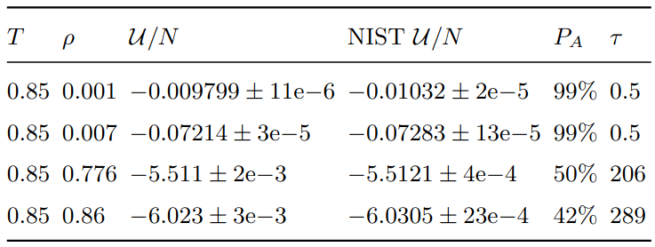
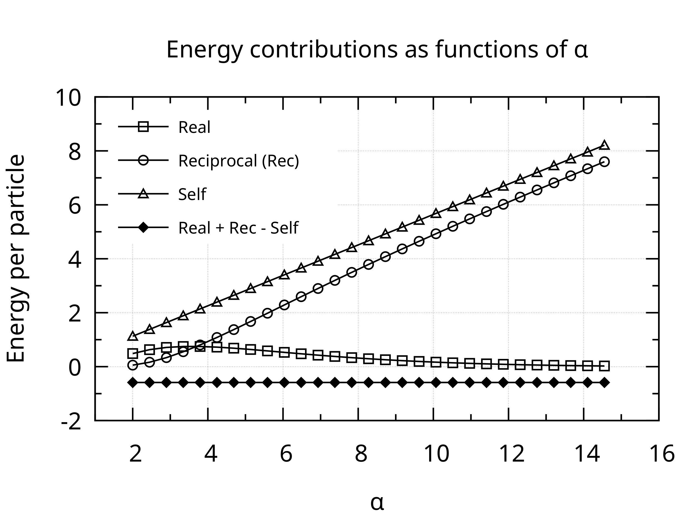
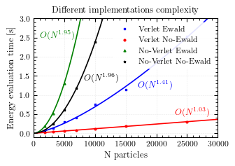

# Metropolis Monte Carlo Simulations of Coupled Lennard-Jones and Coulomb Systems

**Keywords**: _Monte Carlo Methods, Statistical Mechanics, Ewald Summation, Molecular Dynamics, Verlet List_

**Authors**: _Parisi Simone_, _Lenz Patrick_

## Description

For a full project report see [report.pdf](report.pdf).

Monte Carlo simulation of interacting particles under **periodic boundary conditions** using the **Metropolis algorithm** in the canonical ensemble (NVT).

The code supports systems interacting through:

- **Lennard–Jones potential** (short-range interactions)
- **Coulomb like potential** (long-range interactions)

To improve computational efficiency, short-range interactions are evaluated using **Verlet neighbor lists**, reducing the complexity from $O(N^2)$ to approximately $O(N)$ per Monte Carlo step. Long-range interactions are computed through an optimized **Ewald summation**, which has a complexity of $O(N^{3/2})$.

The implementation is written in **C** and designed for studying the equilibrium properties of dense particle systems such as **Lennard-Jones fluids, ionic liquids, and strongly coupled plasmas**.

## Results

The implementation is succesfully tested again the standard [NIST (SRD 173)](https://mmlapps.nist.gov/srs/LJ_PURE/mc.htm) Lennard-Jones fluid simulations database, with equilibrium energies compatible within 2 standard deviation.

    

The Ewald summation implementation is validated by testing the independence of the total coulomb energy from the free parameter $\alpha$.

    

A complexity study is performed, validating the expected complexity of each alghorithm.

    

A study of the equilibrium properties varying the Lennard-Jones and Coulomb coupling constant is performed. As the Coulomb potential becomes dominant over the Lennard-Jones one, the radial distribution functions show the formation of charge shells.

    

