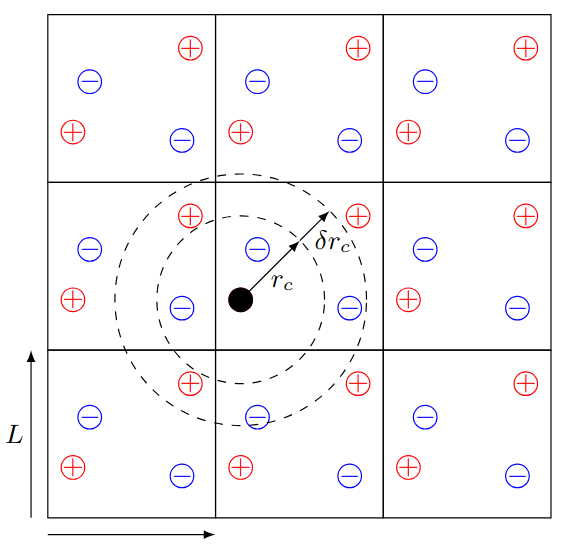
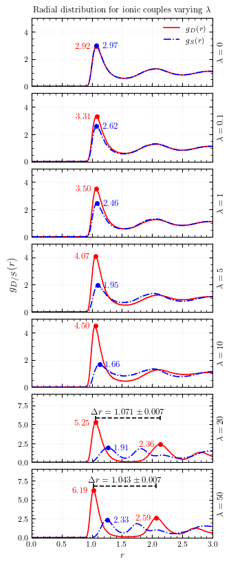

# Metropolis Monte Carlo Simulations of Coupled Lennard-Jones and Coulomb Systems

<p align="center">
  
</p>

<p align="center">
  Snapshot of the simulation box under periodic boundary conditions (PBC), showing oppositely charged particles and the Verlet neighbor-list cutoff.
</p>


**Authors**: _Parisi Simone_, _Lenz Patrick_

**Keywords**: _Monte Carlo Methods, Statistical Mechanics, Ewald Summation, Molecular Dynamics, Verlet List_

**Full project report**: [report.pdf](report.pdf).

---

## Description

Monte Carlo simulation of interacting particles under **periodic boundary conditions** using the **Metropolis algorithm** in the canonical ensemble (NVT).

The code supports systems interacting through:

- **Lennard–Jones potential** (short-range interactions)
- **Coulomb like potential** (long-range interactions)

To improve computational efficiency, short-range interactions are evaluated using **Verlet neighbor lists**, reducing the complexity from $O(N^2)$ to approximately $O(N)$ per Monte Carlo step. Long-range interactions are computed through an optimized **Ewald summation**, which has a complexity of $O(N^{3/2})$.

The implementation is written in **C** and designed for studying the equilibrium properties of dense particle systems such as **Lennard-Jones fluids, ionic liquids, and strongly coupled plasmas**.

---

## Usage

Compile the project with Clang:

```bash
clang -Wall -lm -O2 -std=gnu17 main.c -o ./build/main 
```

or by executing the given ```build_main.sh``` file.

The executable expects the following command-line arguments:

```text
./build/main <lambda> <density> <n_cell_per_row> <lattice_type> <temperature>
```

where:

- `lambda` : Coulomb interaction strength (`0` disables Coulomb interactions).
- `density` : Reduced particle density.
- `n_cell_per_row` : Number of unit cells along each box direction.
- `lattice_type` :
  - `1` = Simple Cubic (SC)
  - `2` = Body-Centered Cubic (BCC)
  - `4` = Face-Centered Cubic (FCC)
- `temperature` : Reduced temperature.

The total number of particles is

$$
N = n_{\text{cell\_per\_row}}^3 \times \text{lattice\_type}.
$$

The cubic simulation box length is

$$
L=\left(\frac{N}{\rho}\right)^{1/3},
$$

where $\rho$ is the reduced number density.

---

## Validation

The implementation has been validated through several benchmark studies:

- Lennard-Jones fluid: comparison with the [NIST Standard Reference Database 173](https://mmlapps.nist.gov/srs/LJ_PURE/mc.htm), obtaining equilibrium energies consistent within two standard deviations.

- Ewald summation: verification that the total electrostatic energy is independent of the Ewald splitting parameter $\alpha$ ([plot](./png/rapporto_real_rec-1.png)).

- Performance analysis: confirmation of the expected computational scaling of both the Verlet neighbor list and Ewald algorithms ([plot](./png/complexity_styled.png)).

---

## Scientific Results

The code has been used to investigate equilibrium properties of systems with competing Lennard-Jones and Coulomb interactions.

By progressively increasing the relative strength of the Coulomb interaction, the simulations reveal the emergence of long-range electrostatic ordering. The radial distribution functions clearly show the formation of charge shells, illustrating the crossover from a Lennard-Jones fluid to a Coulomb-dominated regime.

<p align="center">
    
</p>

---

## References

1. Becker, O. M., MacKerell, A. D., Roux, B., & Watanabe, M. (2001). _Computational Biochemistry and Biophysics_. Marcel Dekker.

2. Kerson Huang (1963). _Statistical Mechanics_ (2nd ed.)

3. Frenkel, D., & Smit, B. (2002). _Understanding Molecular Simulation: From Algorithms to Applications_ (2nd ed.). Academic Press.

4. Chialvo, A. A., & Debenedetti, P. G. (1990). _On the use of the Verlet neighbor list in molecular dynamics_. **Computer Physics Communications**, 60(2), 215–224.

5. Ewald, P. P. (1921). _Die Berechnung optischer und elektrostatischer Gitterpotentiale_. **Annalen der Physik**, 369(3), 253–287.

6. Kolafa, J., & Perram, J. W. (1992). _Cutoff errors in the Ewald summation formulae for point charge systems_. **Molecular Simulation**, 9(5), 351–368.

7. Toukmaji, A. Y., & Board Jr., J. A. (1996). _Ewald summation techniques in perspective: A survey_. **Computer Physics Communications**, 95(2–3), 73–92.

8. Lee, H., & Cai, W. (2009). _Ewald Summation for Coulomb Interactions in a Periodic Supercell_. **Lecture Notes, Stanford University**, 3(1), 1–12.

9. Darden, T., York, D., & Pedersen, L. (1993). _Particle Mesh Ewald: An N·log(N) Method for Ewald Sums in Large Systems_. **The Journal of Chemical Physics**, 98(12), 10089–10092.

10. Metropolis, N., Rosenbluth, A. W., Rosenbluth, M. N., Teller, A. H., & Teller, E. (1953). _Equation of State Calculations by Fast Computing Machines_. **The Journal of Chemical Physics**, 21(6), 1087–1092.

11. Shen, V. K., Siderius, D. W., Krekelberg, W. P., & Hatch, H. W. (2024). _NIST Standard Reference Simulation Website (Standard Reference Database 173)._ National Institute of Standards and Technology.

12. Rasaiah, J. C., Card, D. N., & Valleau, J. P. (1972). _Calculations on the "Restricted Primitive Model" for 1–1 Electrolyte Solutions_. **The Journal of Chemical Physics**, 56(1), 248–255.
